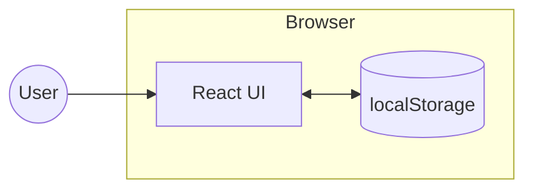
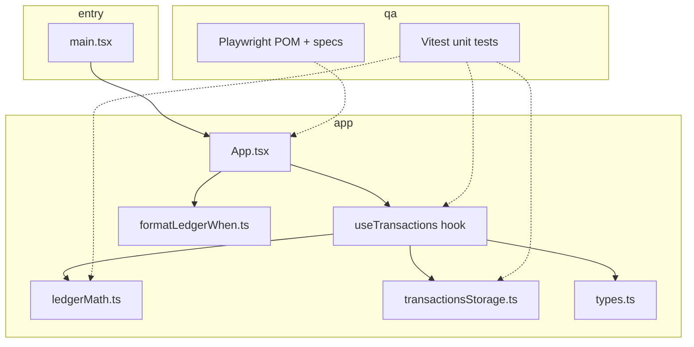
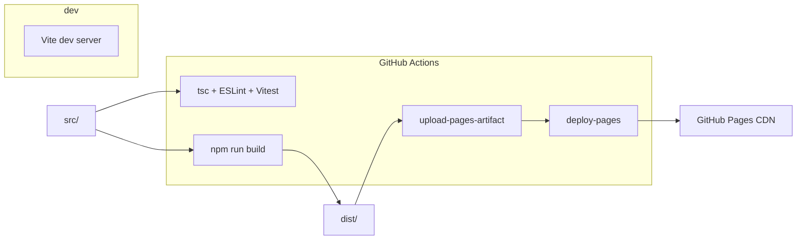
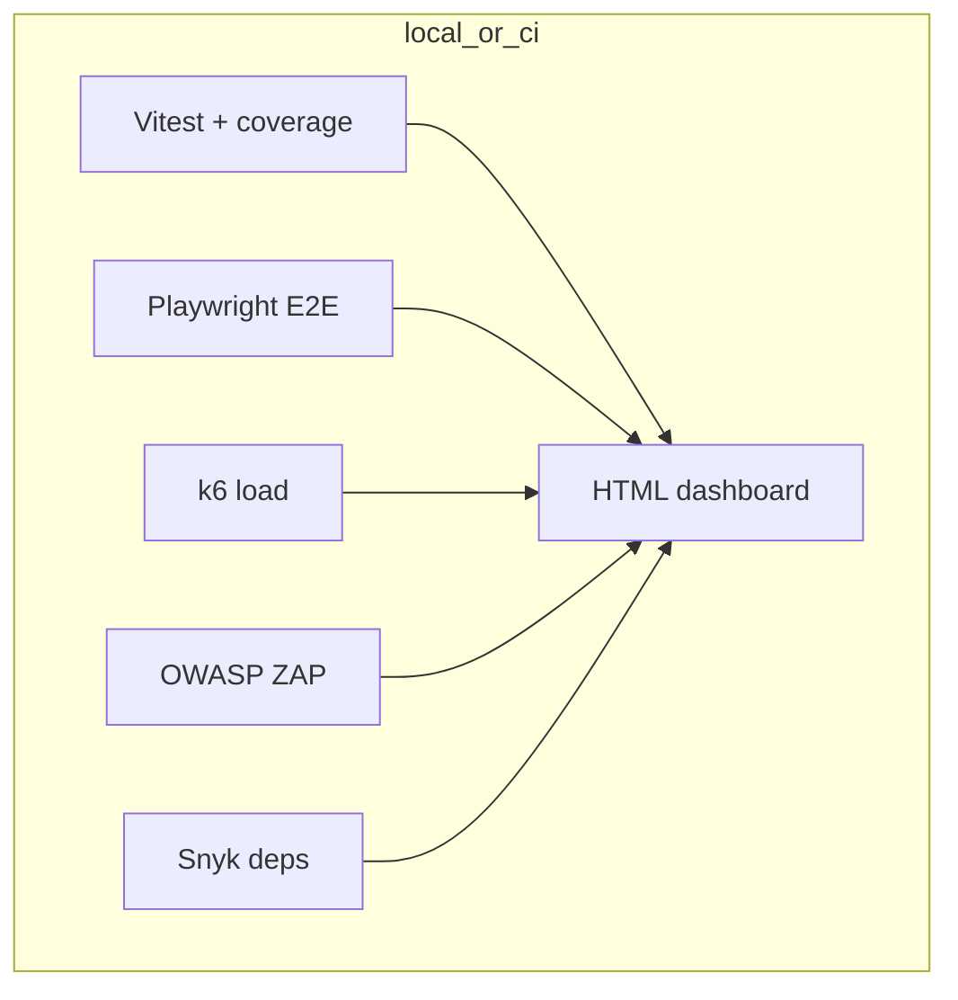

# Architecture — Pocket Ledger

Pocket Ledger is a **static single-page application (SPA)**. All state lives in the browser; there is no backend service in this repository.

## System context

- **React 19** renders the UI and handles forms and lists.
- **`localStorage`** persists the transaction list under the key `money-manager:transactions` (see [`transactionsStorage.ts`](../src/lib/transactionsStorage.ts)).
- **No server**: builds to static files (`dist/`) served by GitHub Pages, nginx (Docker), or any static host.

## Source layout (logical)

| Area | Responsibility |
|------|------------------|
| [`App.tsx`](../src/App.tsx) | Layout, form, list, summaries; wires hook to UI. |
| [`useTransactions.ts`](../src/useTransactions.ts) | React state, `add` / `remove` / `clearAll`, sync to storage. |
| [`ledgerMath.ts`](../src/lib/ledgerMath.ts) | Pure totals (income, expense, balance). |
| [`transactionsStorage.ts`](../src/lib/transactionsStorage.ts) | Parse and load persisted JSON safely. |
| [`formatLedgerWhen.ts`](../src/lib/formatLedgerWhen.ts) | Locale-aware timestamps in the list. |

## Build & deploy

- **Vite** bundles TypeScript + React; `BASE_PATH` is set in CI only for GitHub Pages project URLs (see [`vite.config.ts`](../vite.config.ts)).
- **CI** runs quality checks and produces the static site artifact for Pages (see [`.github/workflows/ci.yml`](../.github/workflows/ci.yml) and [`pages.yml`](../.github/workflows/pages.yml)).

## QA automation (high level)

Details: [QA.md](./QA.md).

## Rendering diagrams

- **GitHub:** Mermaid in Markdown renders in the web UI when viewing `docs/ARCHITECTURE.md` in the repo.
- **Elsewhere:** paste the fenced `mermaid` blocks into [Mermaid Live Editor](https://mermaid.live) to export PNG/SVG for slides.

## Related documentation

- [QA automation](./QA.md)
- [Deployment model](./DEPLOYMENT.md)
- [CI performance notes](./PERFORMANCE.md)
